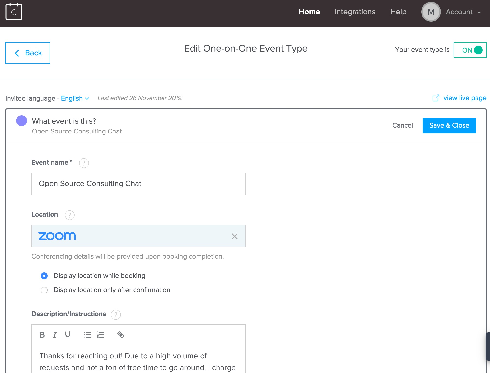

`youtube: EQx5ulvSy68`

Earlier this year, GitHub [announced](https://github.blog/2019-05-23-announcing-github-sponsors-a-new-way-to-contribute-to-open-source/) Sponsors:

> a new way to financially support the developers who build the open source software you use every day

Like all of us, I celebrated the news. Open source projects *need* financial sponsors to motivate maintainers and ensure they stick around.

But let's be honest, if you aren't a large project that's absolutely vital to many large organizations, odds are you won't see sponsorship dollars flowing your way. I'd wager that GitHub Sponsors already follow a [power law](https://www.statisticshowto.datasciencecentral.com/power-law/) distribution with a very small percentage of repos getting most of the available sponsorship funding:

So, what're open source maintainers to do? A lot of the options like having a hosted offering or dual licensing still don't apply well to smaller projects–are you going to dual license your semi-popular NPM package?

I do think there are other options for these smaller projects.

One idea is bug bounties. We've all encountered an issue with an open source project and been annoyed that it took 2 weeks to get a comment from a maintainer. It'd be great if GitHub added the option for a repo to support a bug bounty: allow anyone filing a bug to offer a bounty if addressed within some time frame.

This proposal is complicated because offering money to a maintainer if an issue is closed might simply incentivize them to close issues without solving the underlying problem.

**I'd offer a simpler alternative: offer people your support time for money.**

There are lots of issues where filing a bug seems so much longer than just getting a maintainer on the phone for 30-60m and hashing something out quickly. My hunch is that there's a bigger market for this than we think.

I'm not a prolific open source author, but I've added this method to [two](https://github.com/msukmanowsky/koa-session-firestore) [small](https://github.com/msukmanowsky/gapi-firebase) repos I maintain.

Here's how you can do the same setup.

## 1. Create Accounts

You'll need [Calendly](https://calendly.com/), [Zoom](https://zoom.us/signup) and [PayPal Business](https://www.paypal.com/ca/for-you/account/create-account) accounts if you don't already have them.

## 2. Link PayPal and Zoom to Calendly

[Link](https://calendly.com/integrations) your PayPal and Zoom accounts in Calendly.

## 3. Create A New One-on-One Calendly Event

[Create](https://calendly.com/event_types/new/solo?return_to=%2Fevent_types%2Fuser%2Fme) a new one-on-one event type in Calendly (I called mine "Open Source Consulting Chat"). Set the location to Zoom so that you'll automatically get a video hangout invite with the participant.

Configure the event so that it works for your schedule. I went with the following options:

- 60m minimums
- $80 hourly rate
- Must book 24h in advance
- Events schedlued over rolling 60d
- Cancellation policy: "Cancellations resulting in refunds are only valid when received at least 4 hours before our meeting."
- No screening questions apart from "Please share anything that will help prepare for our meeting."

## 4. Create and Add a Badge to Your Repo

I haven't bothered adding an [official badge](https://github.com/badges/shields) yet, but instead opted to create one in Figma which you're welcome to [clone and edit](https://www.figma.com/file/S3b7XNAUXleRn8uITRhN1f/Book-a-Meeting-Badge?node-id=0%3A1).

Once you've deployed your badge somewhere (AWS S3, Google Cloud Storage), add it to your project's README and other documentation as an option for users looking to get a little face time with you.

## Caveat

This method doesn't work very well for teams of maintainers, but perhaps [Calendly's teams](https://calendly.com/pages/teams) functionality would work. I haven't tried that yet.

## Conclusion

Trading time for money isn't the ideal way we'd like to fund software, but in my opinion, some money is better than none.

I think it's also a great and very human way of connecting with the more passionate users of your project.

The two projects I mentioned above aren't exactly popular open source projects so I don't expect much, but I'd really like to hear from you if you give this a shot and it works for you. I'm available via [twitter](https://twitter.com/msukmanowsky) or [e-mail](mailto:mike.sukmanowsky@gmail.com).
