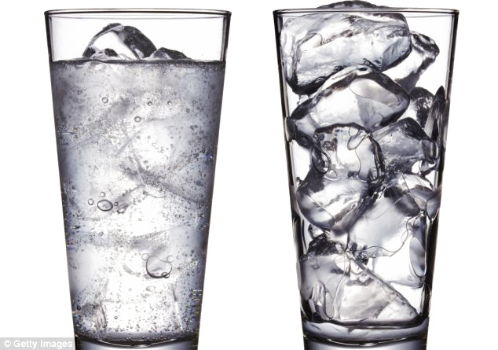

And now for something completely different, here's a wacky idea (not really
fully formed enough to be a theory) that I have about the meaning of life.

**TL;DR the meaning of life is to decrease entropy.**

(Note: I chose the word meaning instead of purpose for this post as purpose
specifically refers to the reason something was created. Life being something
that was "created" assumes a creator was responsible and since I'm not a
religious guy, I don't subscribe to this line of thinking.)

# Entropy and the Second Law of Thermodynamics

While reading Sean Carroll's book, [The Big Picture](https://www.amazon.com/gp/product/1101984252/ref=dbs_a_def_rwt_bibl_vppi_i1)
, I spent some time reflecting on the concept of entropy. Entropy's
a seemingly easily concept with some nuances that trip people up (including
myself). Khan Academy has a good [explainer](https://www.khanacademy.org/science/biology/energy-and-enzymes/the-laws-of-thermodynamics/v/introduction-to-entropy) but here's a quick refresher.

Which of these two pictures has higher entropy?

If you guessed that the melted ice glass on the left has higher entropy, you are
correct. But why?

I like to understand entropy in terms of chance.

This isn't exactly a fair
analogy, but assume I gave you an assortment of hydrogen and oxygen atoms and
told you to shake them up and throw them in a cup. What are the odds that you'd
get ice in the exact same configuration shown in the picture on the right?
Well, there's an astronomical number of atoms in that glass and the odds of
every single one falling falling exactly into place to produce those ice cubes
seems insanely rare.

As ice melts and turns into water however, the configuration "blends" and it is
much easier to produce a glass of water that maintains the same characteristics.

(Aside: another fun way to think about entropy is in the amount of information
needed to describe a system. To build that cup of ice, I have to describe each
and every ice cube's dimensions. A glass of water is as simple as
"go fill up a glass from the tap". Thus we say systems that require a lot of
information to describe them have low entropy whereas systems that require
little information to describe them have higher entropy).

This process of "blending" is happening literally everywhere in the universe.

In fact, the [second law of thermodynamics](https://en.wikipedia.org/wiki/Second_law_of_thermodynamics) states:

> The total entropy of an isolated system can never decrease over time.

Or, stated [differently](http://physics.bu.edu/~duffy/py105/Secondlaw.html):

> The level of disorder in the universe is steadily increasing. Systems tend to
> move from ordered behavior to more random behavior.

If in Avengers Endgame, Thanos represented entropy, a snap of his fingers
wouldn't reduce the population by half but rather instantly turn the universe
into a cold, black, barren, indifferent wasteland of atoms randomly jiggling for
eternity.

This brings me to life.

# Life

Starting with the simplest form of life we know, single-celled organisims, they
represent a move from disorder (an assortment of atoms randomly jiggling around)
to order: Ribonucleic acid (RNA) molecules, cellular nucleus, endoplasm, ectoplasm
and so forth.

In fact, when NASA scientists were asked in 1964 how to go about detecting life
on other planets like Mars, scientist [James Lovelock](https://en.wikipedia.org/wiki/James_Lovelock)
replied:

> I'd look for an entropy reduction, since this must be a general characteristic
> of life.

(Aside: exactly how [order can be dervived from randomness](https://www.youtube.com/watch?v=k9QYtbjzjAw)
is a question that remains unanswered to this day.)

More complex lifeforms like humans seek to push back entropy more agressively.
Our bodies are not only walking examples of entropy decreasing, we seek to
create order from disorder.

We spend energy to craft materials and tools and use them to build strutures,
paint pictures, make music and so on.

As individuals, none of us can escape entropy. We die, our bodies decompose and
the well maintained structure of all our atoms becomes more and more
disorganized (ashes to ashes etc.).

But we also reproduce. If resources exist, we don't just replace ourselves, we grow.
2 becomes 4, 4 becomes 8, 8 becomes 16 and on and on.

If you're like me, you've spent hours wondering why you're here, take solace that
the reason seems to be this: **the meaning of life is to decrease entropy.**

So get out there and create: paint, write, program, build, sing. It's the only
thing it seems we can confidently say life should do.

If you'd like to read more on this subject, I recommend giving these a look:

- [Entropy and Life](<http://www.physics.mcgill.ca/~hilke/181/projects/EntropyandLife%20(final).pdf>) (paper, )
- [What is Life](http://www.whatislife.ie/downloads/What-is-Life.pdf) (book, Erwin Shrodinger)
- [How Does Life Come From Randomness?](https://www.youtube.com/watch?v=k9QYtbjzjAw) (video, David Kaplan)
