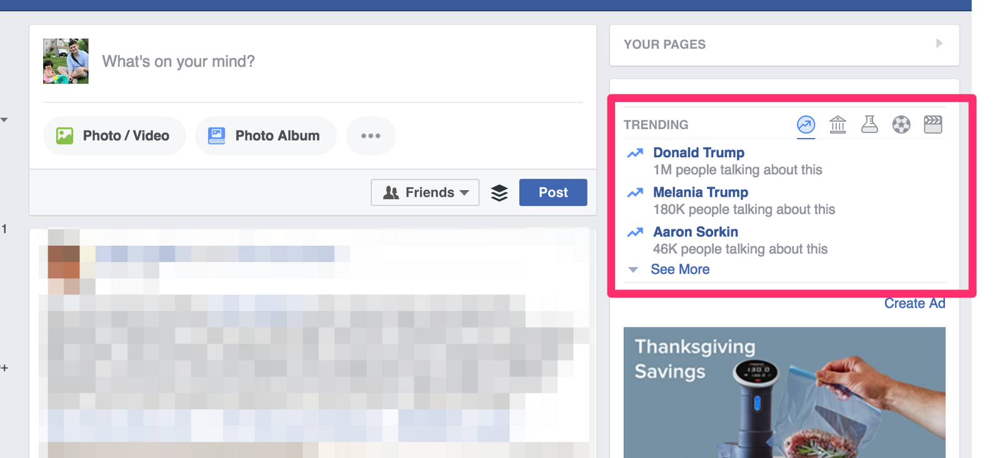

The US election has raised a lot of criticism about the role social media, and specifically Facebook played in the spread of misinformation to the electorate. See [here](http://www.theverge.com/2016/8/30/12702478/facebook-trending-topics-fake-news-megyn-kelly), [here](https://techcrunch.com/2016/11/10/facebook-admits-it-must-do-more-to-stop-the-spread-of-misinformation-on-its-platform/), [here](https://www.nytimes.com/2016/11/09/us/politics/debunk-fake-news-election-day.html), and [here](http://www.niemanlab.org/2016/11/the-forces-that-drove-this-elections-media-failure-are-likely-to-get-worse/).

For those who are unacquainted, the issue is not so much your newsfeed which includes content from sources you’ve explicitly subscribed to (friends or pages you’ve liked), as much as the “Trending” section in the top right of Facebook’s desktop interface.

This area has, at times, linked to trending stories that were complete works of fiction. One of the more controversial was the utterly false account of Fox News anchor, Megyn Kelly supporting Hillary Clinton (the specific headline was “BREAKING: Fox News Exposes Traitor Megyn Kelly, Kicks Her Out for Backing Hillary”). Facebook promptly removed the story, but not before inciting plenty of anger.

In addition to human editors needed for curation, Facebook’s misinformation issue has a simple fix to me: use some notion of domain and URL authority to order things a la Google’s PageRank algorithm. If this were being used by multiple services though, it should be open sourced and added to something like [Common Crawl](http://commoncrawl.org/), thus becoming a “basic decency score” for online content, that could be used by current and new online services to improve the public discourse.

Google, Facebook and others can still compete on proprietary algorithms of course, but agree to this score being incorporated into results.

To be clear, this would be used for ranking content by quality, not outright filtering and exclusion. The idea isn’t to abolish free speech online.

If the notion of an algorithm determining decency sounds controversial to you, I’d agree with you, but Google and Facebook already do this, it’s just opaque (though less so in Google’s case with open source search engine optimization tools like Moz giving you some insight how to improve your domain and page authority).

There are definite problems with the open source approach here. If a party thinks their domain ranking is unfair, what’s their recourse? Open up a Github issue? What if they don’t know how to articulate the algorithmic changes needed to solve the problem? Who maintains this project and is the gatekeeper to accepting changes? Will their biases override the goal of impartiality?

Added transparency may provide too much power to domains that achieve “high authority” and opens up the potential to abuse that power. What if more liberal sources end up with “high authority” than conservative? How could that be used for disservice? But this too already happens. For example, the New York Times knows it has 100/100 domain authority and services like Moz could tell us if we have an authority skew one way or another.

I’m not pretending to have answers to all of these questions, but current open source projects already have some of these problems and they’ve addressed them. I don’t think anything I’ve outlined is insurmountable.

Interested to hear thoughts on this. Are there pros or cons that I’ve missed? Perhaps I’m being naive?
